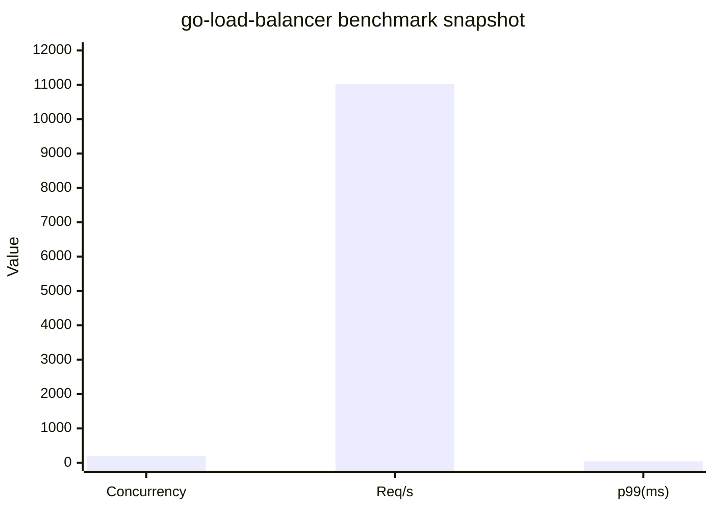
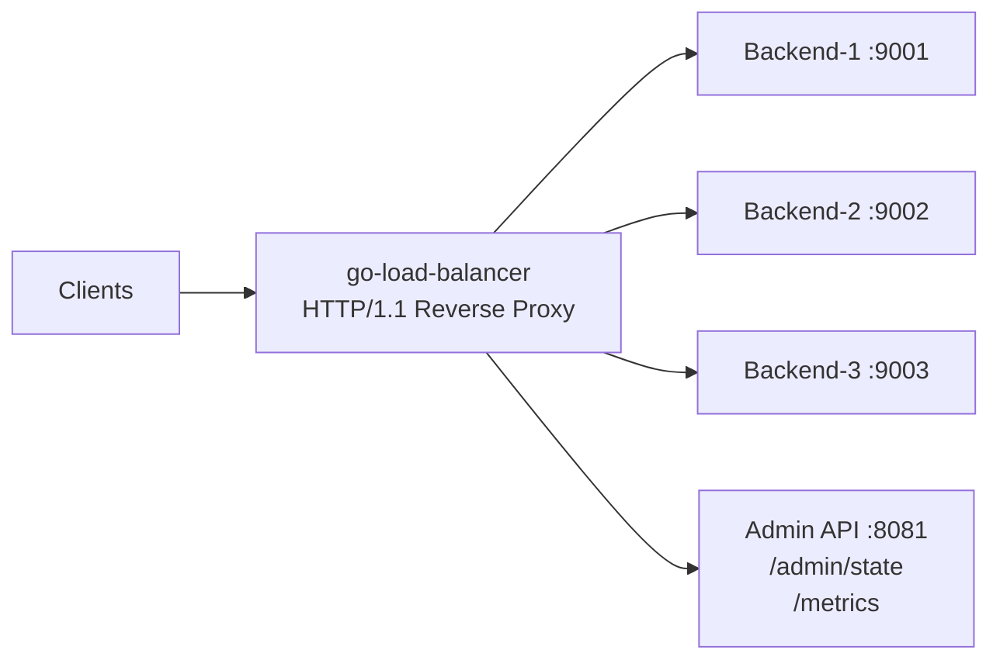

# go-load-balancer

<p align="center">
  
  
  
</p>

High-concurrency, production-focused HTTP load balancer in Go.

- 200 concurrent connections handled on Windows localhost
- ~11k req/s sustained throughput in stress run
- p99 latency at 43 ms
- Health checks, auto-failover, weighted distribution, and live admin APIs


## 1. Hero

go-load-balancer is designed like a real backend component, not a toy reverse proxy. It keeps routing decisions constant-time, uses non-blocking I/O, and exposes enough state to debug traffic behavior quickly.

## 2. 🎯 Features

| Feature | Why It Matters | Status |
|---|---|---|
| Pluggable routing strategies | Round-robin and least-connections support workload-aware balancing | Implemented |
| Active health checks + auto-failover | Removes unhealthy nodes and reintroduces recovered nodes automatically | Implemented |
| Runtime Admin API | Inspect and operate without restart using `/admin/state` | Implemented |
| Prometheus-ready metrics endpoint | `/metrics` exposes request, error, timeout, and backend counters | Implemented |
| Load-test and unit-test coverage | `go test ./...` passes, with k6 + autocannon scripts included | Implemented |

## 3. 📊 Benchmarks

Measured on 2026-03-24, Windows localhost, 3 demo backends.

| Scenario | Concurrency | Duration | Throughput | p99 Latency | Avg Latency | Errors |
|---|---:|---:|---:|---:|---:|---:|
| Stable stress run | 200 | 30s | ~11,020 req/s | 43 ms | 17.65 ms | 0 |
| Total requests in run | 200 | 30s | 331k total | - | - | 0 |

### Throughput and Latency Graph (relatable view)



## 4. 🏗️ Architecture



## 5. 🚀 Quickstart

Copy-paste these 6 commands in separate terminals where noted:

```bash
go mod tidy
go run ./cmd/demo-backend -id backend-1 -port 9001
go run ./cmd/demo-backend -id backend-2 -port 9002
go run ./cmd/demo-backend -id backend-3 -port 9003
go run ./cmd/loadbalancer -config configs/config.yaml
npx --yes autocannon -c 200 -d 30 -p 1 http://127.0.0.1:8080/
```

## 6. 🎥 Demo GIFs

Failover demo:


Metrics dashboard demo:


Strategy switch demo (round-robin to least-connections):


## 7. 📈 Load Test Results Screenshot Placeholders

autocannon terminal output screenshot:


metrics endpoint screenshot during stress:


### Stress metrics snapshots captured from `/metrics`

- `scripts/metrics-stress-ok-1.json`
- `scripts/metrics-stress-ok-2.json`

Weighted distribution observed (`1:1:2`):

- backend-1: 82,692
- backend-2: 82,692
- backend-3: 165,385

## 8. Future Roadmap

- Docker image and docker-compose stack for 1-command startup
- TLS termination and HTTPS upstream support
- Built-in configurable rate limiting profiles
- HTTP/2 frontend and upstream support
- Prometheus exposition format and Grafana starter dashboard

## Production Features Highlight

- Health checks with configurable interval/timeout and failure thresholds
- Auto-failover and auto-recovery backend lifecycle
- Routing: round-robin and least-connections
- Runtime ops: `/admin/state`, `/admin/backends`, `/admin/strategy`
- Observability: `/metrics` for requests, errors, timeouts, and backend activity

## Battle-Tested Status

- `go test ./...` passes
- Load tools included: k6 script and autocannon command flow
- Demo backends included for deterministic local validation
